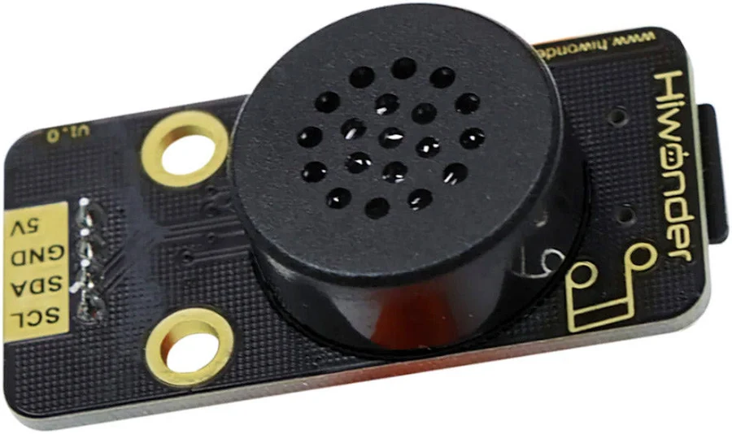
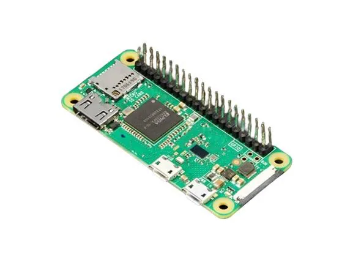
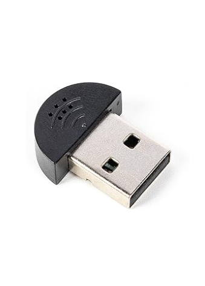
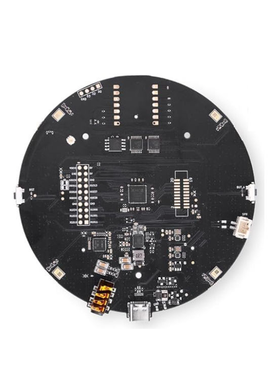

# Claudia

Build your own Claude-powered voice assistant in an afternoon: a Raspberry Pi Zero 2 WH, a hardware wake-word module and a USB mic, about $81 in parts. No soldering, no Alexa account, no subscription.

    



Version 1.0.0. Try it: order the parts below, flash Raspberry Pi OS, then run the installer or follow the guide step by step. You need a [Claude API key](https://console.anthropic.com).

## Why

- Talk to Claude out loud: say "Claudia", ask a question, and hear the answer in seconds.
- Own the whole device. No Alexa or Google account, no always-on cloud microphone, no subscription; you pay only for the API calls you make.
- Assemble it in about 3 minutes with four jumper wires. No soldering iron.
- Keep wake-word detection private: it runs on the WonderEcho chip itself, so nothing streams until you say the word.
- Choose your own speech engines: local Whisper and Piper for offline speech, or OpenAI, Google and ElevenLabs for speed and voice quality.
- Switch real lights with your voice using local-control smart plugs, with no vendor cloud in the loop.

## Features

- Hardware wake word: the Hiwonder WonderEcho recognizes "Claudia" on-device and reports the event over I²C.
- Conversation audio from a USB mic: the SunFounder mini mic, or the Seeed reSpeaker XVF3800 4-mic array for far-field pickup.
- Claude as the brain, through the open-source [PiSugar whisplay-ai-chatbot](https://github.com/PiSugar/whisplay-ai-chatbot) runtime, cloned onto the Pi at build time.
- Swappable speech-to-text (local Whisper, OpenAI Whisper API, Google Cloud STT) and text-to-speech (OpenAI gpt-4o-mini-tts, local Piper, ElevenLabs with a small patch).
- Optional PiSugar 3 battery for a portable build, optional 3D-printed case, optional smart plugs (TP-Link Kasa, Shelly, Sonoff with Tasmota).
- An idempotent Pi installer (`scripts/pi/install-claudia.sh`) that automates the system setup, install and boot-service steps.
- A four-layer healthcheck (`scripts/pi/healthcheck.sh`): WonderEcho on I²C, USB mic in ALSA, network to Anthropic, and a real Claude API call.
- Starts on boot as a systemd service and ends each session after 60 seconds of silence or a stop word.

## Parts list

Prices are approximate USD retail as of 2026-06-09. These tables are static: they are written by hand from [config/parts.json](config/parts.json) and updated by hand when the catalog changes. Check current prices before you order. Buy links follow the catalog's priority order (Amazon, then official store, then reputable sellers).

### Core parts

Required for every build.

| Part | Qty | Unit price | Buy |
| --- | --- | --- | --- |
| Raspberry Pi Zero 2 WH | 1 | $20 | [amazon.com](https://www.amazon.com/s?k=raspberry+pi+zero+2+wh+headers&i=electronics&s=price-asc-rank) |
| microSD card, 32 GB Class 10 (SanDisk Ultra) | 1 | $9 | [amazon.com](https://www.amazon.com/s?k=sandisk+ultra+32gb+microsd&i=electronics&s=price-asc-rank) |
| Official Raspberry Pi 12.5W micro-USB power supply (5V/2.5A) | 1 | $9 | [amazon.com](https://www.amazon.com/s?k=official+raspberry+pi+power+supply+12.5W+micro+usb&s=price-asc-rank) |
| micro-USB OTG adapter (USB-A female) | 1 | $3 | [amazon.com](https://www.amazon.com/s?k=micro+usb+otg+adapter&i=electronics&s=price-asc-rank) |
| Hiwonder WonderEcho voice module (I2C wake-word frontend) | 1 | $24 | [amazon.com](https://www.amazon.com/dp/B0F7RR983M) |
| ELEGOO 120pcs Dupont Jumper Wire Kit (M-F / M-M / F-F) | 1 | $7 | [amazon.com](https://www.amazon.com/dp/B01EV70C78) |
| **Core total** | | **$72** | |

### Conversation microphone

Required: pick one. The WonderEcho only handles the wake word; it never streams audio to the Pi.

| Part | Qty | Unit price | Buy |
| --- | --- | --- | --- |
| SunFounder USB 2.0 Mini Microphone (default) | 1 | $9 | [amazon.com](https://www.amazon.com/SunFounder-Microphone-Raspberry-Recognition-Software/dp/B01KLRBHGM) |
| Seeed reSpeaker XVF3800 USB 4-Mic Array (far-field upgrade) | 1 | $51 | [amazon.com](https://www.amazon.com/ReSpeaker-Microphone-Cancellation-Far-Field-Assistants/dp/B0FKGFXQQ5) |

Default build total, core plus the SunFounder mic: **$81**. With the reSpeaker array instead: **$123**.

### Optional battery

| Part | Qty | Unit price | Buy |
| --- | --- | --- | --- |
| PiSugar 3 1200 mAh battery | 1 | $40 | [amazon.com](https://www.amazon.com/s?k=pisugar+3+1200&i=electronics&s=price-asc-rank) |

### Optional smart plugs

Pick one if you want voice control of a lamp or appliance without a cloud round trip beyond Claude itself.

| Part | Qty | Unit price | Buy |
| --- | --- | --- | --- |
| TP-Link Kasa HS103 / KP125M smart plug (local control via python-kasa) | 1 | $10 | [amazon.com](https://www.amazon.com/s?k=tp-link+kasa+hs103+smart+plug&s=price-asc-rank) |
| Shelly Plug US (local HTTP / MQTT, no cloud required) | 1 | $20 | [amazon.com](https://www.amazon.com/s?k=shelly+plug+us+gen4&s=price-asc-rank) |
| Sonoff S31 (re-flashable with Tasmota for local MQTT control) | 1 | $10 | [amazon.com](https://www.amazon.com/s?k=sonoff+s31&s=price-asc-rank) |

### Part photos

| Pi Zero 2 WH | SunFounder mini mic | reSpeaker XVF3800 array |
| --- | --- | --- |
|  |  |  |

All part photos are in [config/images](config/images).

### Before you start

- WH, not W. The WonderEcho connects to four GPIO pins (SDA, SCL, 5V, GND), so you need the WH variant with pre-soldered headers. The plain W means soldering 40 pins yourself.
- A Windows, macOS or Linux computer to flash the microSD and SSH in, and a way to plug in a microSD card. The SanDisk Ultra ships with a full-size SD adapter but no USB reader; most modern ultrabooks and MacBooks need a USB microSD reader (about $8).
- A 2.4 GHz Wi-Fi network. The Pi Zero 2 WH has no 5 GHz radio.
- Four female-to-female jumper wires to link the WonderEcho to the Pi. The WonderEcho includes no cable; the Dupont kit above covers it.
- The micro-USB OTG adapter, because the Pi Zero has no full-size USB-A port.
- The smart plugs above are US plugs. Kasa, Shelly and Sonoff also sell EU, UK and AU variants that speak the same local API.
- Stock check: the Pi Zero 2 WH is supply-constrained. If every US retailer is out of stock, [rpilocator.com](https://rpilocator.com) tracks live availability across official resellers.

## Quick start

1. Order the core parts and one microphone.
2. Wire the WonderEcho to the Pi with four jumpers and plug the USB mic into the middle `USB` port through the OTG adapter (see Assemble).
3. Flash Raspberry Pi OS 64-bit with hostname `claudia`, SSH and Wi-Fi enabled (see Flash the microSD), then boot the Pi.
4. Copy the installer to the Pi and run it from your computer, as shown below.
5. Put your Claude API key in `~/whisplay-ai-chatbot/.env` (see Configure the chatbot) and run `bash ~/healthcheck.sh`. You should see four green check marks.
6. Say "Claudia" and ask a question. Claude answers out loud.

```bash
scp scripts/pi/install-claudia.sh <your-username>@claudia.local:~
ssh <your-username>@claudia.local 'bash ~/install-claudia.sh'
```

The installer is idempotent: it updates the system, trims unused services, installs build dependencies, enables I²C, writes `~/.asoundrc` if absent, clones and builds `whisplay-ai-chatbot`, refuses to continue with a placeholder `ANTHROPIC_API_KEY`, runs the healthcheck and registers the `chatbot.service` boot unit. Safe to re-run. The manual steps follow.

## How it works

The WonderEcho is a command-word recognizer, not a microphone. Its CI1302 chip recognizes the wake word on-device and reports a short event over I²C. It never streams raw audio, so Whisper cannot transcribe through it. The WonderEcho handles the always-listening wake word; the USB mic, a standard ALSA device, records what you actually say.

```text
  This repo (Claudia)                          On the Pi (after following the guide)
  +-------------------------+                  +---------------------------------------+
  | README.md (build guide) |  builder follows | Raspberry Pi OS 64-bit                |
  | config/parts.json       | ---------------> |  whisplay-ai-chatbot (cloned upstream)|
  | config/versions.json    |                  |   ASR > Claude (LLM) > TTS pipeline   |
  | config/env.template     |                  |   systemd chatbot.service             |
  | config/asoundrc.usbmic  |                  +-------+---------------+---------------+
  | scripts/pi/*.sh         |                          | I2C (4 wires) | USB OTG
  | docs/ (Codex canon)     |                          v               v
  +-------------------------+                  WonderEcho (0x52)   USB mic (ALSA)
                                               wake word "Claudia"  conversation audio
                                                                   |
                                                                   v HTTPS
                                                         api.anthropic.com (Claude)
```

Only the Claude API call is mandatory cloud traffic. Speech-to-text, text-to-speech and smart-home control each have a local option.

| Layer | What it is |
| --- | --- |
| Hardware | Pi Zero 2 WH, USB mic (SunFounder mini or reSpeaker XVF3800), Hiwonder WonderEcho (I²C wake word), optional PiSugar 3 battery |
| OS | Raspberry Pi OS 64-bit |
| Wake word | "Claudia", detected on the WonderEcho with no Pi-side listener |
| Microphone | USB mic via OTG adapter as the default ALSA capture device |
| Speech to text | Local Whisper, or cloud STT if configured |
| LLM | Claude API (Anthropic) |
| Text to speech | OpenAI gpt-4o-mini-tts (recommended), Piper (local), or ElevenLabs (with patch) |
| Service manager | systemd (`chatbot.service`, set up by `startup.sh`) |

## Build options

The catalog defines six choices in `configAxes` inside [config/parts.json](config/parts.json). The guide marks where each one changes a step.

| Choice | Options | Default |
| --- | --- | --- |
| Battery | No (desktop, wall-powered), Yes (PiSugar 3, portable) | No |
| Conversation microphone | SunFounder USB mini mic, reSpeaker XVF3800 4-mic array | SunFounder |
| Speech to text | Whisper (local, free), OpenAI Whisper API, Google STT | Whisper local |
| Text to speech | OpenAI gpt-4o-mini-tts, ElevenLabs (requires patch), Piper (local, free) | OpenAI |
| 3D-printed case | None, FDM (filament), SLA (resin) | None |
| Smart-home control | None, TP-Link Kasa, Shelly Plug US, Sonoff S31 with Tasmota | None |

## Assemble

Total time is about 3 minutes. No soldering.

1. Do not insert the microSD yet. You flash it in the next stage.
2. Connect the WonderEcho to the Pi's I²C header with 4 female-to-female Dupont jumper wires: `SDA → BCM 2 (pin 3)`, `SCL → BCM 3 (pin 5)`, `5V → pin 2`, `GND → pin 6`.
3. Plug the micro-USB OTG adapter into the Pi's middle port labelled `USB` (the data port, not the corner `PWR IN` port), then plug the USB microphone into the adapter.
4. Position the mic. The SunFounder mini mic is a thumb-size dongle that hangs off the OTG adapter; point its grille toward where you will speak. The reSpeaker XVF3800 array sits flat with its mics facing the room (its beamforming works best with an unobstructed 360° view) and connects to the OTG adapter with its own USB cable.
5. Make sure the WonderEcho's speaker face is unobstructed; its on-board mic listens for the wake word.
6. Battery build only: snap the PiSugar 3 onto the underside of the Pi with its magnetic, spring-loaded pogo pins.

Final layout: WonderEcho (via I²C wires) to Pi Zero 2 WH to USB mic (via OTG), either wall-powered or on the PiSugar 3.

Checkpoint: the four I²C wires are seated firmly, the USB mic is in the middle `USB` port via the OTG adapter, and the WonderEcho's grille is unobstructed.

## Flash the microSD

If your laptop has no SD-card slot, plug in a USB microSD reader now.

Download Raspberry Pi Imager from raspberrypi.com/software (Windows, macOS, Linux), then:

1. Open Raspberry Pi Imager.
2. Choose Device: `Raspberry Pi Zero 2 W`. Imager does not distinguish W from WH; the OS image is the same.
3. Choose OS: `Raspberry Pi OS (other)`, then Raspberry Pi OS (64-bit), the full version, not Lite. The chatbot's install script expects packages from the full image; Lite works but needs extra apt installs.
4. Choose Storage: your microSD card.
5. Click the gear icon for Edit Settings and set the options listed below.
6. Save, then Write. It takes 2 to 5 minutes.

Edit Settings:

- Hostname: `claudia`
- Username: anything other than `pi`. Pi OS Bookworm deprecated the default `pi` user and current Imager builds warn or refuse.
- Password: something secure
- Enable SSH with password authentication
- Wireless LAN: your home Wi-Fi SSID and password
- Locale: your timezone (for example `America/Chicago`) and keyboard layout (for example `us`)

### First boot

1. Insert the microSD into the Pi.
2. Plug the official power supply into the `PWR IN` micro-USB port (nearest the corner). Not the middle `USB` port.
3. Wait 60 to 90 seconds.
4. SSH in from your computer. If `claudia.local` does not resolve, find the Pi's IP in your router's admin page and use that instead.

```bash
ssh <your-username>@claudia.local
```

Checkpoint: you see the `<your-username>@claudia:~ $` prompt. `cat /etc/os-release` says Debian/Raspberry Pi OS, and `free -h` shows about 430 MB of `Mem:` (the Pi Zero 2 WH has 512 MB).

## System setup

Run these from the SSH session, one at a time.

### Update

This takes 5 to 15 minutes on a Pi Zero 2 WH.

```bash
sudo apt update && sudo apt full-upgrade -y
```

### Free up RAM

The Pi Zero 2 WH has only 512 MB. Disable services this build does not use:

```bash
# Disable Bluetooth (not used by this build)
sudo systemctl disable hciuart bluetooth

# Disable triggerhappy (gamepad daemon, not needed)
sudo systemctl disable triggerhappy
```

### Install build dependencies

```bash
sudo apt install -y git curl build-essential python3-pip python3-venv \
  portaudio19-dev libsndfile1 ffmpeg alsa-utils libatlas-base-dev
```

### Enable I2C and detect the WonderEcho

Turn the bus on, install i2c-tools, and reboot:

```bash
# Enable I²C non-interactively
sudo raspi-config nonint do_i2c 0

# Tools + Python bindings
sudo apt install -y i2c-tools python3-smbus

sudo reboot
```

After it reboots, SSH back in and run the command below. You should see a device address, commonly `0x52` for the WonderEcho (check the sticker on the module).

```bash
i2cdetect -y 1
```

Checkpoint: `i2cdetect -y 1` lists at least one device address.

### Verify the USB microphone

The USB mic is a standard USB Audio Class device, so no driver is needed. Confirm ALSA sees it:

```bash
arecord -l
```

The mic should appear as a capture card, typically `card 1` (`card 0` is the Pi's HDMI output, which has no capture side). Make it the default capture device so the chatbot's recorder finds it:

```bash
nano ~/.asoundrc
```

Paste the following. The same file ships in this repo as [config/asoundrc.usbmic](config/asoundrc.usbmic).

```text
pcm.!default {
    type asym
    playback.pcm {
        type plug
        slave.pcm "hw:0,0"
    }
    capture.pcm {
        type plug
        slave.pcm "hw:1,0"
    }
}

ctl.!default {
    type hw
    card 1
}
```

If `arecord -l` showed your mic on a different card number, change `hw:1,0` and `card 1` to match.

reSpeaker XVF3800 bonus: the array also has a playback side, a 3.5 mm jack plus a JST connector driving up to 5 W speakers (see the Seeed wiki under Reference). Point `playback.pcm` at the reSpeaker's card too and one device covers both mic and speaker.

Record a 3-second test clip:

```bash
arecord -d 3 -f S16_LE -r 16000 /tmp/mictest.wav
```

Checkpoint: `arecord -l` lists the USB mic and the test recording completes without `audio open error`.

## Install the chatbot

The runtime is PiSugar's `whisplay-ai-chatbot`. Claudia uses it as the speech and LLM plumbing without the Whisplay HAT itself. Wake-word detection goes through the WonderEcho; conversation audio comes from the USB mic as the default ALSA capture device.

```bash
cd ~
git clone https://github.com/PiSugar/whisplay-ai-chatbot.git
cd whisplay-ai-chatbot
bash install_dependencies.sh
source ~/.bashrc
```

The dependency install pulls Node.js, Python packages and audio libraries and takes 15 to 25 minutes. The `source ~/.bashrc` line matters: the installer sets PATH entries you need in the current shell.

Checkpoint: `install_dependencies.sh` finishes without errors and `node --version` prints `v24.x` or newer.

## Get an API key

1. Go to console.anthropic.com and sign in or create an account.
2. Add a payment method and a small amount of credit (for example $5).
3. Open API Keys and click Create Key.
4. Name it `claudia` and copy the key now; you cannot see it again.
5. Treat the key like a password.

Casual personal use on `claude-haiku-4-5-20251001` typically costs a few dollars a month at most. Check current pricing at anthropic.com/pricing.

### Which model to pick

| Model ID | Speed | Quality | When to use |
| --- | --- | --- | --- |
| `claude-haiku-4-5-20251001` | Fastest | Good | Default for this device. Latency matters more than essay-grade prose for a voice assistant. |
| `claude-sonnet-4-6` | Medium | Excellent | Richer answers if you do not mind a slower response. |
| `claude-opus-4-7` | Slowest | Best | Overkill for spoken Q&A. Use for hard reasoning only. |

Model IDs change over time. The current list is at [docs.claude.com](https://docs.claude.com/en/docs/about-claude/models/overview).

## Configure the chatbot

### Create your env file

```bash
cd ~/whisplay-ai-chatbot
cp .env.template .env
nano .env
```

The template has fields for many providers. For a Claude build, set the LLM section to Anthropic:

```env
# === LLM (the AI brain) ===
LLM_SERVER=anthropic
ANTHROPIC_API_KEY=sk-ant-YOUR-KEY-HERE
ANTHROPIC_MODEL=claude-haiku-4-5-20251001

# === System prompt — shapes the assistant's voice ===
SYSTEM_PROMPT=You are a concise, friendly voice assistant. Answer in plain spoken English — no markdown, no bullet lists, no headings. Keep responses to 1–3 sentences unless the user explicitly asks for more.
```

An example `.env` also ships in this repo as [config/env.template](config/env.template).

The wake-word listener does not run on the Pi. The Pi only polls the WonderEcho's wake-event register over I²C, so no wake-word env keys are needed. When a wake event fires, the chatbot records from the USB mic; the WonderEcho's own mic is used only by its on-chip detector.

Upstream names the provider keys `LLM_SERVER`, `ASR_SERVER` and `TTS_SERVER`, and its plugin registry switches on the lowercase value (see `src/cloud-api/server.ts` upstream). The `.env.template` evolves; if yours differs from this guide, the [live template](https://github.com/PiSugar/whisplay-ai-chatbot/blob/master/.env.template) is the source of truth.

Save with `Ctrl+X`, `Y`, `Enter`.

### Speech to text options

Whisper, local: already wired up by the template defaults. The slowest option on a Pi Zero 2 WH (about 3 to 6 seconds per utterance), but needs no API key and works offline.

OpenAI Whisper API: round trip drops to about 0.5 to 1 second, at a few cents per hour of speech. Add to `.env`:

```env
ASR_SERVER=openai
OPENAI_API_KEY=sk-REPLACE-ME
```

Google Cloud STT: put the service-account JSON from Google Cloud Console at the path below. Generally the fastest cloud STT on US-region traffic. Add to `.env`:

```env
ASR_SERVER=google
GOOGLE_APPLICATION_CREDENTIALS=/home/pi/google-stt-key.json
```

### Text to speech options

OpenAI gpt-4o-mini-tts (recommended): supported by upstream out of the box. The 4o-series voices (`alloy`, `nova`, `onyx`, `marin`, `cedar`, plus the older `echo`, `fable`, `shimmer`, `ash`, `ballad`, `coral`, `sage`, `verse`) sound far more natural than the older `tts-1`. Roughly $0.015 per minute of speech. Add to `.env`:

```env
TTS_SERVER=openai
OPENAI_API_KEY=sk-REPLACE-ME
OPENAI_VOICE_MODEL=gpt-4o-mini-tts
OPENAI_VOICE_TYPE=nova
```

Piper, local: free and runs on the Pi. Robotic but understandable, fine for short replies. Add to `.env`:

```env
TTS_SERVER=piper
PIPER_BINARY_PATH=/usr/local/bin/piper
PIPER_MODEL_PATH=/home/pi/piper/voices/en_US-amy-low.onnx
```

### ElevenLabs patch

ElevenLabs has very natural voices, but upstream ships no ElevenLabs handler. You add one: about 40 lines of TypeScript and one registration entry.

Step 1, the handler. Create `~/whisplay-ai-chatbot/src/cloud-api/elevenlabs/elevenlabs-tts.ts`:

```typescript
import mp3Duration from "mp3-duration";
import { TTSResult } from "../../type";

// The chatbot already loads .env at startup, so process.env is populated
// by the time this plugin's activate() runs — no need to call dotenv here.
const apiKey     = process.env.ELEVENLABS_API_KEY     || "";
const voiceId    = process.env.ELEVENLABS_VOICE_ID    || "EXAVITQu4vr4xnSDxMaL"; // "Bella"
const modelId    = process.env.ELEVENLABS_MODEL_ID    || "eleven_turbo_v2_5";    // low-latency
const stability  = parseFloat(process.env.ELEVENLABS_STABILITY  || "0.5");
const similarity = parseFloat(process.env.ELEVENLABS_SIMILARITY || "0.75");

const elevenLabsTTS = async (text: string): Promise<TTSResult> => {
  if (!apiKey) { console.error("ELEVENLABS_API_KEY is not set."); return { duration: 0 }; }
  const url = `https://api.elevenlabs.io/v1/text-to-speech/${encodeURIComponent(voiceId)}`;
  let res: Response;
  try {
    res = await fetch(url, {
      method: "POST",
      headers: {
        "xi-api-key": apiKey,
        "Content-Type": "application/json",
        "Accept": "audio/mpeg",
      },
      body: JSON.stringify({
        text,
        model_id: modelId,
        voice_settings: { stability, similarity_boost: similarity },
      }),
    });
  } catch (e) {
    console.log("ElevenLabs TTS request failed:", e);
    return { duration: 0 };
  }
  if (!res.ok) {
    console.log("ElevenLabs TTS HTTP " + res.status + ": " + (await res.text().catch(() => "")));
    return { duration: 0 };
  }
  const buffer = Buffer.from(await res.arrayBuffer());
  const duration = await mp3Duration(buffer);
  // mp3-duration returns undefined if it can't parse the stream; coerce to
  // 0 so downstream code never sees NaN.
  return { buffer, duration: (duration ?? 0) * 1000 };
};

export default elevenLabsTTS;
```

Step 2, register the plugin. Open `~/whisplay-ai-chatbot/src/plugin/builtin/tts.ts` and add this block next to the other `pluginRegistry.register(...)` calls:

```typescript
pluginRegistry.register({
  name: "elevenlabs",
  displayName: "ElevenLabs TTS",
  version: "1.0.0",
  type: "tts",
  audioFormat: "mp3",
  description: "ElevenLabs text-to-speech (high-quality cloud voices)",
  activate: () => {
    const ttsProcessor = require("../../cloud-api/elevenlabs/elevenlabs-tts").default;
    return { ttsProcessor };
  },
} as TTSPlugin);
```

Step 3, the `.env` entries:

```env
TTS_SERVER=elevenlabs
ELEVENLABS_API_KEY=sk_REPLACE_ME
ELEVENLABS_VOICE_ID=EXAVITQu4vr4xnSDxMaL
ELEVENLABS_MODEL_ID=eleven_turbo_v2_5
ELEVENLABS_STABILITY=0.5
ELEVENLABS_SIMILARITY=0.75
```

Step 4, rebuild and restart:

```bash
cd ~/whisplay-ai-chatbot
bash build.sh
sudo systemctl restart chatbot.service
```

For voice IDs, log in to [elevenlabs.io](https://elevenlabs.io), open VoiceLab and copy the ID of a cloned or stock voice. `eleven_turbo_v2_5` has the lowest latency and is recommended for the Pi Zero 2 WH. Cost is roughly $0.18 per 1000 characters (about 7 to 8 cents per minute of speech).

### Build the project

This compiles the TypeScript and prepares assets, about 5 to 10 minutes on a Pi Zero 2 WH.

```bash
bash build.sh
```

Checkpoint: `build.sh` exits cleanly with no errors.

### Program the WonderEcho wake word

The WonderEcho runs its own on-device wake-word detector, so the Pi does not have to listen. You program the trigger phrase once over I²C; the module then flags a wake event on the bus whenever it hears the word, and the chatbot polls that register to start a recording session.

> Verify before running. The I²C register layout (`0x10` as the set-trigger opcode below) depends on your WonderEcho firmware revision. Check the [Hiwonder WonderEcho page](https://www.hiwonder.com/products/wonderecho) for the register map that matches your unit; the snippet is the canonical pattern, not a guaranteed copy-paste for every firmware.

```bash
# Reference snippet: writes the trigger word to the WonderEcho's "set-trigger"
# register. Confirm the register/opcode against the Hiwonder wiki for your
# firmware revision before relying on this in production.
cd ~/whisplay-ai-chatbot
python3 - <<'PY'
import smbus2 as smbus, time
bus = smbus.SMBus(1)          # I²C bus 1 on the Pi Zero
ADDR = 0x52                    # WonderEcho default — confirm with i2cdetect
WORD = b"claudia"
bus.write_i2c_block_data(ADDR, 0x10, list(WORD) + [0])   # 0x10 = set-trigger
time.sleep(0.2)                                          # let the WonderEcho commit the trigger to its on-board flash before we close the bus
print("Wake word programmed:", WORD.decode())
PY
```

No Python venv, no openWakeWord, no training. If your unit reports a different I²C address in `i2cdetect -y 1` or uses a different set-trigger opcode, use the register map for your firmware.

Checkpoint: say "Claudia" near the module and `journalctl -u chatbot.service -f` shows a wake event within about 300 ms.

## Healthcheck

Before launching the full chatbot, run the 90-second healthcheck. It verifies four layers: the WonderEcho is on the I²C bus, the USB mic is visible to ALSA, the network reaches Anthropic, and your API key and model return a response. The full audio round trip is exercised by the manual launch in the next section.

The script is [scripts/pi/healthcheck.sh](scripts/pi/healthcheck.sh). Copy it to the Pi as `~/healthcheck.sh`, or create it with `nano ~/healthcheck.sh` and paste:

```bash
#!/bin/bash
# claudia healthcheck — quick end-to-end smoke test
# Usage: bash ~/healthcheck.sh

set -u
ENV_FILE="$HOME/whisplay-ai-chatbot/.env"
PASS="\033[0;32m✓\033[0m"
FAIL="\033[0;31m✗\033[0m"
exit_code=0

step() { printf "\n%s\n" "── $1 ──"; }
ok()   { printf "  $PASS %s\n" "$1"; }
bad()  { printf "  $FAIL %s\n" "$1"; exit_code=1; }

step "1. WonderEcho module on I2C"
# The WonderEcho is the wake-word frontend and talks to the Pi over I2C bus 1.
# It is NOT an audio device — it never appears in ALSA.
if command -v i2cdetect >/dev/null 2>&1; then
    if i2cdetect -y 1 2>/dev/null | grep -qE ' 5[234] '; then
        ok "WonderEcho detected on I2C bus 1"
    else
        bad "WonderEcho NOT detected on I2C bus 1 (check 4-pin wiring + 'sudo raspi-config nonint do_i2c 0')"
    fi
else
    bad "i2c-tools not installed - run 'sudo apt install -y i2c-tools' (see Part 05.4)"
fi

step "2. USB microphone in ALSA"
# Conversation audio comes from the USB mic — a standard USB Audio Class
# device that must show up as an ALSA capture card (see Part 5.5).
if command -v arecord >/dev/null 2>&1; then
    if arecord -l 2>/dev/null | grep -q '^card '; then
        ok "ALSA capture device present: $(arecord -l 2>/dev/null | grep '^card ' | head -1)"
    else
        bad "no ALSA capture device — is the USB mic in the middle 'USB' port via the OTG adapter? (Part 03 / 5.5)"
    fi
else
    bad "alsa-utils not installed - run 'sudo apt install -y alsa-utils' (see Part 05.3)"
fi

step "3. Network reachability"
# Use HTTPS instead of ping — many networks/APIs drop ICMP but pass TLS.
# A 4xx response still proves we got a real reply from api.anthropic.com.
net_code=$(curl -sS -o /dev/null -w '%{http_code}' --max-time 5 https://api.anthropic.com/ 2>/dev/null || echo "000")
if [ "$net_code" != "000" ]; then
  ok "api.anthropic.com responded (HTTP $net_code)"
else
  bad "cannot reach api.anthropic.com (Wi-Fi, DNS, or TLS issue)"
fi

step "4. Claude API call"
if [ ! -f "$ENV_FILE" ]; then
  bad "$ENV_FILE not found — finish Part 08 first"
else
  # shellcheck disable=SC1090
  set -a; source "$ENV_FILE"; set +a
  if [ -z "${ANTHROPIC_API_KEY:-}" ]; then
    bad "ANTHROPIC_API_KEY is empty in .env"
  else
    response=$(curl -s -w "\n%{http_code}" https://api.anthropic.com/v1/messages \
      -H "x-api-key: $ANTHROPIC_API_KEY" \
      -H "anthropic-version: 2023-06-01" \
      -H "content-type: application/json" \
      -d "{\"model\":\"${ANTHROPIC_MODEL:-claude-haiku-4-5-20251001}\",\"max_tokens\":50,\"messages\":[{\"role\":\"user\",\"content\":\"Say hello in exactly 5 words.\"}]}")
    http_code=$(echo "$response" | tail -n1)
    body=$(echo "$response" | sed '$d')
    if [ "$http_code" = "200" ]; then
      ok "Claude API responded HTTP 200"
      # Prefer jq if available — it handles escaped quotes correctly. Fall
      # back to a grep+sed that breaks on escapes but is good enough for a
      # smoke-test "did Claude reply" sanity check.
      if command -v jq >/dev/null 2>&1; then
        reply=$(echo "$body" | jq -r '.content[0].text // empty' 2>/dev/null)
      else
        reply=$(echo "$body" | grep -o '"text":"[^"]*"' | head -1 | sed 's/"text":"//;s/"$//')
      fi
      echo "  Reply: $reply"
    else
      bad "Claude API returned HTTP $http_code"
      echo "  $body" | head -3
    fi
  fi
fi

echo
if [ $exit_code -eq 0 ]; then
  printf "$PASS All checks passed. You're ready for Part 10.\n"
else
  printf "$FAIL One or more checks failed. Fix above before running the chatbot.\n"
fi
exit $exit_code
```

Run it:

```bash
chmod +x ~/healthcheck.sh
bash ~/healthcheck.sh
```

Checkpoint: all four sections print green check marks. Fix any failure before moving on.

## Run

### Manual launch

Run in the foreground for testing:

```bash
cd ~/whisplay-ai-chatbot
bash run_chatbot.sh
```

Say "Claudia". The WonderEcho hears the wake word, the chatbot records your question from the USB mic, and Claude answers out loud. Sessions end after 60 seconds of silence or when you say a stop word (`byebye`, `goodbye` or `stop`). Stop the process with `Ctrl+C`.

### Start on boot

Upstream's startup installer registers a `chatbot.service` systemd unit and switches the system to multi-user (headless) mode:

```bash
cd ~/whisplay-ai-chatbot
bash startup.sh
```

The chatbot now starts on every boot. Verify with the command below; you should see `Active: active (running)`.

```bash
sudo systemctl status chatbot.service
```

### Live logs

```bash
tail -f ~/whisplay-ai-chatbot/chatbot.log
# or
journalctl -u chatbot.service -f
```

### Tuning wake-word reliability

The WonderEcho exposes I²C registers for tuning. See the [Hiwonder WonderEcho page](https://www.hiwonder.com/products/wonderecho) for the register map for your firmware.

- Too many false wakes (TV, conversation): raise the detection threshold.
- Missed wakes (you have to say it twice): lower the threshold, or move the module closer to where you sit.

## Smart home

If you bought a smart plug, teach Claudia to flip it by giving the chatbot a tool: a small shell command it can invoke when your request matches.

### TP-Link Kasa

Local control through `python-kasa`, for the HS103 or KP125M:

```bash
pip install python-kasa --break-system-packages

# Find your plug on the LAN
kasa discover

# Toggle it (replace IP)
kasa --host 192.168.1.42 on
kasa --host 192.168.1.42 off
```

Expose `kasa --host <ip> on` and `off` as a tool the LLM can call. No vendor account and no cloud hop; it works even when the Kasa cloud is down.

### Shelly Plug US

Local HTTP. Find the plug's IP in your router admin or the Shelly app, then:

```bash
# On
curl "http://192.168.1.42/relay/0?turn=on"
# Off
curl "http://192.168.1.42/relay/0?turn=off"
```

No vendor account and no SDK; wire those two `curl` calls into the chatbot as tools.

### Sonoff S31 with Tasmota

Out of the box the S31 uses the eWeLink cloud. Reflash it with Tasmota (no soldering needed on the S31, which has a serial header; the S31 template is listed on templates.blakadder.com) to expose a local HTTP endpoint:

```bash
curl "http://192.168.1.42/cm?cmnd=Power%20On"
curl "http://192.168.1.42/cm?cmnd=Power%20Off"
```

More work to flash, but you get full local control and power-usage telemetry over MQTT.

## Case

PiSugar publishes free STL files for case shells:

- [pi02 Whisplay chatbot case, FDM (filament print)](https://github.com/PiSugar/suit-cases/tree/main/pisugar3-whisplay-chatbot-fdm)
- [pi02 Whisplay chatbot case, SLA (resin print)](https://github.com/PiSugar/suit-cases/tree/main/pisugar3-whisplay-chatbot)

No printer? Upload the STL to a print service such as [JLC3DP](https://jlc3dp.com) or [Craftcloud](https://craftcloud3d.com), a few dollars shipped.

## Troubleshooting

### Nothing plays through the speaker

- TTS playback goes to the Pi's default ALSA output (`aplay -l` shows it), not to the WonderEcho; its on-board speaker plays only its own firmware phrases. Check which card playback uses in `~/.asoundrc` and that a speaker is attached to it.
- Watch `journalctl -u chatbot.service -f` for TTS lines. If Claude replies but you hear nothing, the playback device is wrong or muted (`alsamixer`, F6 to pick the card).

### Mic captures silence or garbage

- Run `arecord -l`. If the USB mic is missing, reseat the OTG adapter in the middle `USB` port (the corner port is power only) and check `dmesg | tail` for USB errors.
- If the card number changed after a reboot, update `hw:1,0` in `~/.asoundrc` to match `arecord -l`, or pin the mic to index 1 in `/etc/modprobe.d/alsa-base.conf`.
- Test in isolation with `arecord -d 3 -f S16_LE -r 16000 /tmp/mictest.wav`. If this errors, the problem is ALSA config, not the chatbot.
- If the wake event never fires when you speak, that is the WonderEcho, not the mic. The wake word may have been reset on a cold boot; re-run the wake-word programming snippet.

### Build fails out of memory

The Pi Zero 2 WH has only 512 MB. Add swap if `build.sh` gets OOM-killed:

```bash
sudo dphys-swapfile swapoff
sudo sed -i 's/^CONF_SWAPSIZE=.*/CONF_SWAPSIZE=1024/' /etc/dphys-swapfile
sudo dphys-swapfile setup
sudo dphys-swapfile swapon
```

### Service will not start

Look for the first ERROR line; it is usually a missing `.env` key or a wrong path.

```bash
sudo systemctl status chatbot.service --no-pager
journalctl -u chatbot.service -n 60 --no-pager
```

### Claude API returns 401

The API key is invalid or expired. Copy it again from console.anthropic.com, API Keys.

### Claude API returns 429

You are rate-limited. Add credit at console.anthropic.com, Billing.

### WonderEcho does not respond

- Run `i2cdetect -y 1` and confirm the module's address still shows up.
- Re-run the wake-word programming snippet; the setting can be lost on cold boots.
- Watch `journalctl -u chatbot.service -f` while you speak. If the wake event never fires, an I²C wire may have come loose or the module's mic is covered.

### Wake word triggers on TV

Raise the WonderEcho's detection threshold over I²C; the register address depends on your firmware revision.

### Responses feel slow

- Use `claude-haiku-4-5-20251001`, the recommended default for this reason.
- The Pi Zero 2 WH's Wi-Fi antenna is weak. Move it closer to the router.
- Local Whisper is the slowest step. A cloud STT key (OpenAI or Google) cuts perceived latency a lot.

### SD card filling up

```bash
df -h
sudo apt clean
# clear chatbot recordings:
rm -f ~/whisplay-ai-chatbot/data/recordings/*.wav 2>/dev/null
```

## Scripts and tools

| Entry point | Runs on | Purpose |
| --- | --- | --- |
| `scripts/pi/install-claudia.sh` | Raspberry Pi (bash) | Idempotent installer for the system setup, chatbot install, healthcheck and boot service. Safe to re-run. |
| `scripts/pi/healthcheck.sh` | Raspberry Pi (bash) | Four-layer smoke test: WonderEcho on I²C, USB mic in ALSA, network to `api.anthropic.com`, and a Claude API call that must return HTTP 200. |
| `tools/codex.ps1 doctor` | Windows PowerShell 5.1 | Validates the docs: front matter, unique ids, cross-references, JSON and schema validity for the config files, catalog id uniqueness, cited paths and digest freshness. Must exit 0. |
| `tools/codex.ps1 digest` | Windows PowerShell 5.1 | Regenerates `docs/BIBLE.digest.md` from the bible, the story statuses and any pending decisions. |
| `tools/build-readme.ps1` | Windows PowerShell 5.1 | Regenerates README.htm from this README through the shared MindAttic engine. |

## Configuration

| File | What it holds |
| --- | --- |
| [config/parts.json](config/parts.json) | The shopping catalog and the six build-option axes. Every part has an id, category, price, specs, buy-link tiers and an optional gate on a build option. Prices are dated estimates. Ids are mirrored in [docs/data/parts.index.json](docs/data/parts.index.json) and validated by the schema in [docs/data](docs/data). |
| [config/versions.json](config/versions.json) | Pinned upstream version labels: Node major, system Python, Raspberry Pi OS label, default Claude model. Kept in sync with this README by hand. |
| [config/env.template](config/env.template) | Example `.env` for `~/whisplay-ai-chatbot/.env`: provider keys and the system prompt. The installer copies it when the Pi's own template is missing. |
| [config/asoundrc.usbmic](config/asoundrc.usbmic) | ALSA profile that makes the USB mic the default capture device (card 1) and leaves playback on card 0. The installer writes it if `~/.asoundrc` does not exist. |
| [config/images](config/images) | Part photos referenced by the catalog. |

Build-option contract: an option `key=value` is valid only if the `configAxes` block, each part's gate and this README's build-options table agree. `codex.ps1 doctor` checks that every part gate names a known axis; the README side is checked by review.

## Project layout

```text
Claudia/
  README.md                 project page and build guide (this file)
  AGENTS.md                 agent entry point
  config/
    parts.json              shopping catalog and build options
    versions.json           pinned upstream version labels
    env.template            example .env for the Pi
    asoundrc.usbmic         ALSA profile for the USB mic
    images/                 part photos
  scripts/pi/
    install-claudia.sh      idempotent Pi installer
    healthcheck.sh          four-layer smoke test
  tools/
    codex.ps1               doctor and digest
    build-readme.ps1        regenerates README.htm
  docs/
    BIBLE.md                architecture, laws, verified state, glossary
    AMENDMENTS.md           pending decisions (normally empty)
    USER_STORIES.md         stories with their verifying checks
    BIBLE.digest.md         generated, never hand-edited
    rfc/                    open design proposals
    data/                   catalog id index and schema
```

## Testing

There is no compiler and no test runner. Build means regenerating generated files; test means these checks pass. Run from the repo root in Windows PowerShell 5.1:

```powershell
powershell -NoProfile -ExecutionPolicy Bypass -File tools/codex.ps1 digest
powershell -NoProfile -ExecutionPolicy Bypass -File tools/codex.ps1 doctor
powershell -NoProfile -ExecutionPolicy Bypass -File tools/build-readme.ps1
```

Reviewed by hand, not automated:

- The Pi scripts are syntax-checked with `bash -n` and kept idempotent.
- New or edited build options are checked to agree between the axes and the part gates.

## Limitations

- On-hardware behaviour (WonderEcho detection, the wake to Claude to speech round trip, the boot service) is not exercised in CI; those stories stay partial until proven on a real Pi.
- The WonderEcho register map depends on firmware revision, so the wake-word and threshold snippets need checking against your unit.
- ElevenLabs needs a hand-applied patch to the upstream chatbot.

## Documentation

- [docs/BIBLE.md](docs/BIBLE.md): what Claudia is and is not, architecture, laws, verified state, glossary
- [docs/AMENDMENTS.md](docs/AMENDMENTS.md): decisions not yet folded into the bible (normally empty)
- [User stories](docs/USER_STORIES.md): Epics A to D (configure and shop, assemble and flash, install and converse, verify and operate)
- [AGENTS.md](AGENTS.md): instructions for AI agents working in this repo

This README on GitHub is the project page; it is a static page with no build or deploy step. Releases bump the major version only (1.0.0, 2.0.0, 3.0.0).

Reference links:

- [Hiwonder WonderEcho](https://www.hiwonder.com/products/wonderecho)
- [SunFounder USB mini mic](https://www.sunfounder.com/products/mini-usb-microphone)
- reSpeaker XVF3800 wiki: `https://wiki.seeedstudio.com/respeaker_xvf3800_introduction/`
- [PiSugar whisplay-ai-chatbot](https://github.com/PiSugar/whisplay-ai-chatbot)
- [Claude API docs](https://docs.claude.com)
- [Claude model catalog](https://docs.claude.com/en/docs/about-claude/models/overview)
- [Anthropic pricing](https://anthropic.com/pricing)

## License

This repo has no LICENSE file. All rights reserved. The chatbot runtime is the separate, upstream [PiSugar whisplay-ai-chatbot](https://github.com/PiSugar/whisplay-ai-chatbot) project under its own license.

Part of [MindAttic](https://mindattic.com) — see more projects at [github.com/mindattic](https://github.com/mindattic). Related: [ChiMesh](https://github.com/mindattic/ChiMesh), another MindAttic hardware build.
